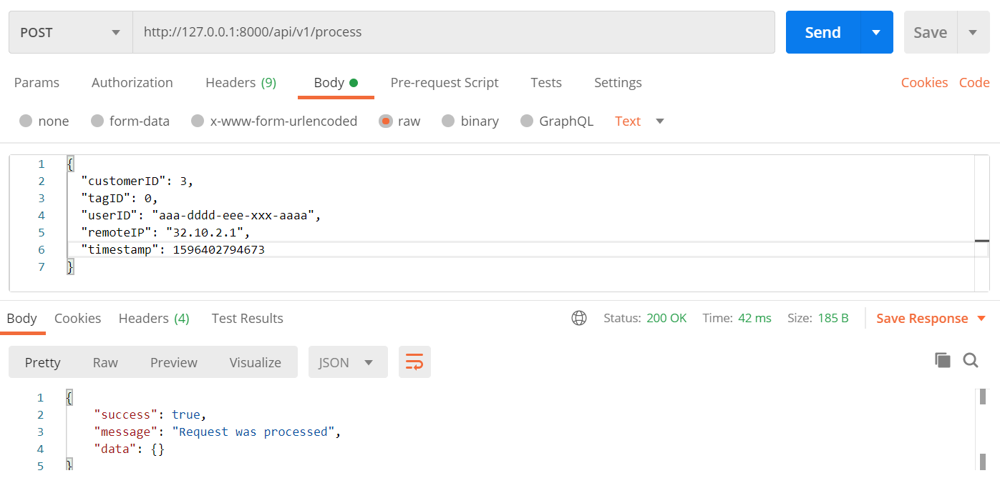
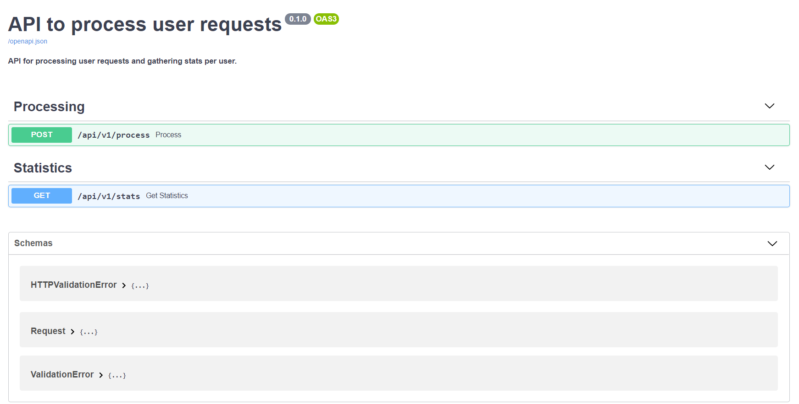

# Simple API Gateway Request Validator

## Description

This repo serves the purpose of building an HTTP service that 
- receives requests
- check the validity of each request
- reject invalid requests
- count and store statistics per customer per hour

Requests considered as invalid are:
* malformed JSON
* missing one or more fields
* with a customer ID not found in the database or for a customer which is disabled
* with a remote IP address which is in the blacklist
* with a user agent which is in the blacklist

The service provides
- an endpoint to insert and process customer requests 
- an endpoint to get the statistics
  - for a specific customer and a specific days
  - the total number of requests for that day

## Setup Needed
### DB Setup

- Install [MySQL](https://dev.mysql.com/doc/mysql-installation-excerpt/5.7/en/)
- Using Adminer, MySQL Workbench, or any tool of your choice
	- Create a DB called `mycompany`
	- Run the following SQL queries inside `mycompany` to create relevant tables and sample data.

```sql
CREATE TABLE `customer` (
  `id` int(11) unsigned NOT NULL AUTO_INCREMENT,
  `name` varchar(255) NOT NULL,
  `active` tinyint(1) unsigned NOT NULL DEFAULT '1',
  PRIMARY KEY (`id`)
);
```
Customer 1 will act as a placeholder customer for all requests coming with an unknown customerID.  This customer is disabled.

```sql
INSERT INTO `customer` VALUES (1, 'The Unknown Customer', 0), (2,'Big News Media Corp',1),(3,'Online Mega Store',1),(4,'Nachoroo Delivery',0),(5,'Euro Telecom Group',1);
```
```sql
CREATE TABLE `ip_blacklist` (
  `ip` int(11) unsigned NOT NULL,
  PRIMARY KEY (`ip`)
);
```
```sql
INSERT INTO `ip_blacklist` VALUES (0),(2130706433),(4294967295);
```
```sql
CREATE TABLE `ua_blacklist` (
  `ua` varchar(255) NOT NULL,
  PRIMARY KEY (`ua`)
);
```
```sql
INSERT INTO `ua_blacklist` VALUES ('A6-Indexer'),('Googlebot-News'),('Googlebot');
```
```sql
CREATE TABLE `hourly_stats` (
  `id` int(11) unsigned NOT NULL AUTO_INCREMENT,
  `customer_id` int(11) unsigned NOT NULL,
  `time` timestamp NOT NULL,
  `request_count` bigint(20) unsigned NOT NULL DEFAULT '0',
  `invalid_count` bigint(20) unsigned NOT NULL DEFAULT '0',
  PRIMARY KEY (`id`),
  UNIQUE KEY `unique_customer_time` (`customer_id`,`time`),
  KEY `customer_idx` (`customer_id`),
  CONSTRAINT `hourly_stats_customer_id` FOREIGN KEY (`customer_id`) REFERENCES `customer` (`id`) ON DELETE CASCADE ON UPDATE NO ACTION
);
```

Create the procedure which will help us update the customer requests stats.

```sql
CREATE PROCEDURE `update_hourly_stats`(IN customer_request_id INT, IN request_time TIMESTAMP, IN is_valid_request BOOL)
BEGIN
	DECLARE increment_invalid_by, increment_valid_by INT default 0;
	IF (is_valid_request)
		THEN SET increment_valid_by = 1;
        ELSE SET increment_invalid_by = 1;
	END IF;
	INSERT INTO hourly_stats (customer_id, time, request_count, invalid_count) 
	VALUES (customer_request_id, request_time, increment_valid_by, increment_invalid_by)
	ON DUPLICATE KEY 
		UPDATE 	request_count = request_count + increment_valid_by,
				invalid_count = invalid_count + increment_invalid_by;
END
```


## Python Environment

Based on these [benchmarks](https://www.techempower.com/benchmarks/#section=data-r19&hw=ph&test=fortune&l=zijzen-1r) showing that FastAPI is overall one of the fastest Python web frameworks, and given its [popularity](https://github.com/tiangolo/fastapi) and extensive [documentation](https://fastapi.tiangolo.com/), I decided to use FastAPI to build the current request processing API. 

**Python Version:**  3.7.2

To make sure the current projects' requirements do not interfer with your system's libraries, we create a virtual environment.

First make sure virtualenv is installed (on Ubuntu)
```bash
sudo apt-get install python3-venv
```

Create the `api-validator` venv
```bash
python3 -m venv api-validator
```

Activate the env (on Ubuntu)
```bash
source api-validator/bin/activate
```
Install the needed requirements
```bash
pip install -r requirements.txt
```

## Usage

### Serving the API

Make sure to activate your venv first.
From the root directory execute the following command to serve the API locally on port 8000 using uvicorn.
```bash
uvicorn src.main:app --reload
```

For a successful start, you should see the following output

```bash
INFO:     Uvicorn running on http://127.0.0.1:8000 (Press CTRL+C to quit)
INFO:     Started reloader process [13692] using statreload
INFO:     Started server process [5312]
INFO:     Waiting for application startup.
INFO:     Application startup complete.
```

### Testing using PostMan

You can test your API using PostMan or by sending curl commands.

PostMan


cURL
```bash
curl --location --request POST 'http://127.0.0.1:8000/api/v1/process' \
--header 'Content-Type: application/json' \
--data-raw '{
    "customerID": 3,
    "tagID": 0,
    "userID": "aaa-dddd-eee-xxx-aaaa",
    "remoteIP": "32.10.2.1",
    "timestamp": 1596402794673
}'
```

### Swagger Docs

Once the API is up and running, you can check the swagger docs on the `/` route.  Usually by following `http://localhost:8000/`

You should see the following:



This also allows you to test the API from the Web Browser as well as read description about each endpoint.

### Running Unit Tests

Unit Test are written using `pytest`

To run all tests inside the folder `test`, run the following

```bash
pytest
```

You should get

```bash
collected 5 items

test/test_main.py ..... 
                                     [100%]

============ 5 passed in 0.74s ============ 
```


## References

For the API structure and DB access using the ORM approach (SQLAlchemy), I used this [great tutorial form FastAPI](https://fastapi.tiangolo.com/tutorial/sql-databases/)

Unit Testing of the FastAPI API followed best practices [in this tutorial](https://fastapi.tiangolo.com/tutorial/testing/)

HTTP Error Codes and their explanations can be found on [MDN Web Docs](https://developer.mozilla.org/en-US/docs/Web/HTTP/Status)

## Issues?

You have problems running the code or any suggestion for improvement?  Please don't hesitate to make your changes and open a Pull Request or even write a detailed description of your problem as a new Issue!

## TODO Later

- [ ] Add Docker support
  - [ ] One Dockerfile for the FastAPI Code
  - [ ] One Dockerfile for MySQL
  - [ ] One docker-compose to run the whole app
- [ ] Extensive Unit Testing
- [ ] CI/CD Pipeline using Jenkins or GitHub Actions

## Author

[Nour Azzi](mailto:nour.azzi@hotmail.com), Software Engineer
